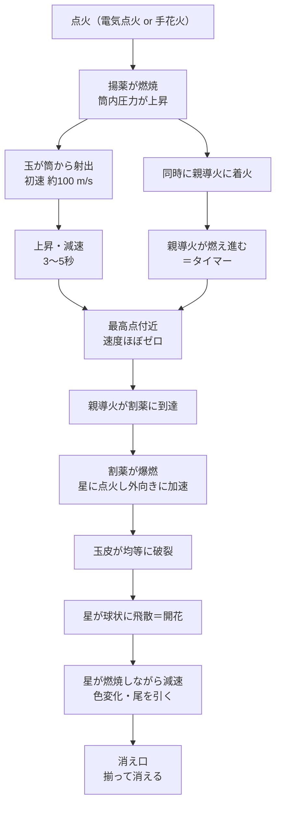

# 花火の教科書

**― 化学・物理・歴史・美学から学ぶ煙火の総合テキスト ―**

---

## この教科書について

花火は「化学の実験」であり「物理の応用」であり、同時に「日本が数百年かけて磨いた造形芸術」でもあります。本書は、花火をただ「きれい」で終わらせず、**なぜあの色になるのか / なぜ丸く開くのか / なぜ日本の花火は世界一と言われるのか**を体系的に理解するための教科書です。

### 対象読者

- 花火を科学として理解したい人（高校化学・物理の基礎があると読みやすい）
- 花火大会をより深く楽しみたい人、写真を撮りたい人
- 煙火業界・イベント業界に関心のある人

### 本書の構成と使い方

全10章＋付録。各章は「**学習目標 → 本文 → まとめ → 演習問題**」の順で構成されています。演習の解答は付録Bにあります。

| 部 | 章 | テーマ |
|---|---|---|
| 第Ⅰ部 導入 | 第1章 | 花火とは何か・歴史 |
| 第Ⅱ部 理論 | 第2〜4章 | 火薬の化学・発色の科学・音と力学 |
| 第Ⅲ部 構造 | 第5〜7章 | 玉の解剖・種類と美学・仕掛花火 |
| 第Ⅳ部 実践 | 第8〜10章 | 現代技術・安全と法規・観賞と撮影 |
| 付録 | A〜D | 用語集・解答・参考文献・早見表 |

### ⚠️ きわめて重要な注意（必ず読んでください）

本書は**花火の原理を理解するための教育用テキスト**です。火薬の調合手順、配合量の設計、造粒・圧搾・玉込めなどの**製造方法は一切記載していません**。

- 日本では火薬類の製造・所持・消費は**火薬類取締法**によって厳格に規制されており、無許可の製造は犯罪です（第3条・第21条ほか）。
- 花火の材料は少量でも**摩擦・静電気・衝撃で容易に発火**し、死亡・失明・四肢欠損に至る事故が実際に起きています。
- 「自分で作ってみる」は本書の目的ではありません。作りたい人が進むべき道は、**煙火業者への就職または花火師への師事**という正規のルートだけです。

本書で学べるのは「理屈」であり、「手順」ではありません。この一線は意図的に引かれています。

---

# 第Ⅰ部 導入

## 第1章 花火とは何か ― 定義と歴史

### 学習目標

1. 「花火（煙火）」を火薬工学的に定義できる
2. 黒色火薬の起源から観賞用花火への転換の流れを説明できる
3. 日本の花火が「和火」から「洋火」へ移る技術的転換点を指摘できる

### 1.1 花火の定義

花火（**煙火**〈えんか〉が業界・法令上の呼称）とは、

> **火薬類の燃焼・爆発によって生じる光・音・煙・火の粉を、観賞または信号を目的として制御した装置**

です。ポイントは「**制御**」の一語にあります。火薬は放っておけばただ爆発するだけですが、花火はそれを

- **時間**（いつ光るか：導火線と時差設計）
- **空間**（どこで、どんな形に広がるか：星の配置と割薬の力）
- **色**（何色に光るか：金属塩と燃焼温度）
- **音**（どんな音を出すか：笛薬・雷薬）

の4軸で設計します。花火師の仕事は「爆発を作る」ことではなく、**爆発を思った通りの形に整える**ことです。

### 1.2 火薬の起源 ― 中国

黒色火薬の起源は中国です。唐代（9世紀ごろ）の錬丹術（不老不死の薬を求める術）の文献に、硝石・硫黄・炭を混ぜると激しく燃えるという記述が現れます。**不老長寿を求めて、最も死に近い物質が生まれた**というのは科学史の有名な皮肉です。

宋代には「爆竹」「煙火」として娯楽と儀礼に使われるようになりました。もともとは竹を焼いて破裂音を出し**邪気を払う**ものであり、花火の起源は宗教儀礼にあります。この「音で祓う」という発想は、後の日本の花火にも深く残ります。

### 1.3 ヨーロッパへ ― 兵器から祝祭へ

13世紀にイスラム世界経由でヨーロッパに伝わった火薬は、まず**兵器**として発達しました（大砲・銃）。同時にルネサンス期のイタリアでは、王侯の祝祭を飾る**観賞用花火**が発達します。とくにフィレンツェ・シエナの火工師たちが、金属粉を加えて火花を明るくする技術を進めました。

ヨーロッパ花火の特徴は「**構造物としての花火**」です。木枠に火薬を仕込んだ仕掛（イタリア語で *macchina*）を燃やして、宮殿や神殿の絵を火で描く。地上の造形が主役でした。

### 1.4 日本の花火史

#### (1) 伝来（16世紀）

1543年（天文12年）の鉄砲伝来とともに火薬が日本に入りました。花火として記録に残る最古級のものは、1613年（慶長18年）に**徳川家康**が駿府城でイギリス人の見せた花火を見物したという記述です（『駿府政事録』）。ただしそれ以前にも伊達政宗の観覧記録などがあり、諸説あります。

#### (2) 江戸の花火文化（17〜19世紀）

江戸時代、花火は町人文化として爆発的に発展します。

- **1659年（万治2年）**：初代・弥兵衛が江戸日本橋で**鍵屋**を創業（現存する宗家花火鍵屋）
- **1733年（享保18年）**：前年の飢饉と疫病の死者を弔い悪疫退散を祈って、両国・隅田川の**川開き**で花火が打ち上げられたとされる。これが現在の**隅田川花火大会**の起源とされます（年次には諸説あり）
- 19世紀初頭：鍵屋から分家した**玉屋**が台頭。両者が腕を競い、観衆は「**たまや〜、かぎや〜**」と声を掛けた。日本の花火が「競技」として発展する原型がここにあります

重要なのは、**日本の花火は死者の供養と疫病退散から始まった**という点です。夏の花火大会が今もお盆の時期に多いのは偶然ではありません。**花火は本来、鎮魂の火**です。

#### (3) 和火 ― 色のない時代

明治より前の日本の花火を**和火（わび）**と呼びます。酸化剤は硝石（硝酸カリウム）しかなく、燃焼温度が低いため、色は**炭火色の橙〜赤褐色**一色でした。

しかし和火は劣ったものではありません。ゆっくり燃え、深い橙色の火の粉が柔らかく流れる。現代でも「和火」は意図的に作られ、**渋さと余韻**で評価されます。金属粉のギラギラした輝きがない代わりに、線香花火のような静かな品格があります。

#### (4) 洋火 ― 色彩革命（明治以降）

明治になり、**塩素酸カリウム KClO₃**、**過塩素酸カリウム KClO₄**、**硝酸ストロンチウム Sr(NO₃)₂** などの「洋薬」が輸入されると、状況は一変します。これらは硝石より強力な酸化剤で、**炎の温度を大幅に上げられる**ため、金属塩による鮮やかな発色が可能になりました。

赤・緑・青が出せるようになった――これが日本の花火の第二の誕生です。以後、日本の花火師は色の技術に日本独自の**幾何学的完成度**（真円・同心円・整った消え口）を組み合わせ、世界に類のない「**割物**」の伝統を作り上げます。

### 1.5 日本の花火が世界で特別な理由

| 観点 | 欧米型花火 | 日本型花火 |
|---|---|---|
| 玉の形 | 円筒形（シェル）が主流 | **球形**が基本 |
| 開いた形 | 方向性があり、扇形・不定形も可 | **真球・同心円**を理想とする |
| 評価軸 | 全体の演出・音楽との同期 | **一発の完成度**（真円・星の揃い・消え口） |
| 構造 | 単層の星が多い | **芯入り**（多重同心円）が発達 |

球形の玉は、どの方向から見ても同じ真円に開きます。これを実現するには、玉皮の中に星を**完全な同心球状に**並べ、割薬を均等に効かせなければなりません。日本の花火は「**一発の彫刻**」として評価される文化を作った、という点で世界的に特異です。

### まとめ

- 花火＝火薬の燃焼を光・音・煙として時間・空間・色・音の4軸で制御した装置
- 起源は中国の錬丹術と邪気払いの儀礼、ヨーロッパで観賞用に発達
- 日本では江戸の町人文化として発展、鎮魂と疫病退散が原点
- 明治の洋薬導入（強力な酸化剤）が色彩革命をもたらした
- 日本花火の独自性は「球形・真円・芯入り」という幾何学的完成度

### 演習問題 1

1. 「花火」を火薬工学的に一文で定義せよ。
2. 和火が橙色一色だった理由を、酸化剤の観点から説明せよ。
3. 日本の花火が球形・真円を理想とすることの技術的な難しさを述べよ。

---

# 第Ⅱ部 理論

## 第2章 火薬の化学 ― 燃焼と酸化還元

### 学習目標

1. 燃焼の三要素と、火薬が「自己完結した燃焼系」であることを説明できる
2. 主な酸化剤・燃料（還元剤）の役割を分類できる
3. 黒色火薬の組成と反応の概略を書ける
4. 酸素バランスの概念を理解し、燃焼特性との関係を説明できる

### 2.1 燃焼の三要素と火薬の特異性

ふつうの燃焼には **① 燃料 ② 酸素（酸化剤） ③ 熱（着火エネルギー）** が必要です。焚き火は空気中の酸素を使うので、酸素の供給速度（＝空気の流れ）が燃焼速度の上限を決めます。

火薬が決定的に違うのは、**酸化剤を自分の中に持っている**点です。

$$\text{火薬} = \text{燃料} + \text{酸化剤（固体として混合済み）}$$

このため火薬は

- 空気がなくても燃える（真空中でも、水中でも燃える）
- 燃焼速度が空気の供給に律速されない → **極端に速く燃える**
- 密閉すると発生ガスが逃げず、圧力が急上昇して**爆発**になる

という性質を持ちます。花火の設計とは、この「速すぎる燃焼」を、**どこでどれだけ速くするか**を作り分ける技術です。星はゆっくり燃えてほしい、割薬は一瞬で効いてほしい。同じ原理の物質を、粒度と配合と密度で作り分けます。

### 2.2 酸化剤 ― 酸素の供給源

| 物質 | 化学式 | 特徴 |
|---|---|---|
| 硝酸カリウム（硝石） | KNO₃ | 黒色火薬の主成分。穏やか、吸湿性が低い。和火の主役 |
| 過塩素酸カリウム | KClO₄ | 強力で比較的安定。現代の色火薬の中心。塩素供与も兼ねる |
| 塩素酸カリウム | KClO₃ | 非常に強力だが**感度が高く危険**。硫黄との併用は自然発火の恐れがあり現代では極力回避 |
| 硝酸ストロンチウム | Sr(NO₃)₂ | 酸化剤かつ**赤色**の発色剤 |
| 硝酸バリウム | Ba(NO₃)₂ | 酸化剤かつ**緑色**の発色剤 |
| 過塩素酸アンモニウム | NH₄ClO₄ | 高性能。ロケット推進剤でも使われる |

> **学習ポイント**：硝酸ストロンチウムや硝酸バリウムのように、**酸化剤と発色剤を兼ねる**物質があります。花火の配合表を読むとき、「この成分は何役なのか」を意識すると構造が見えてきます。
>
> **なぜ塩素酸カリウムが危険か**：KClO₃ は分解開始温度が低く、硫黄や硫化物（不純物として硫酸を生じうる）と混ざると常温でも発熱反応が進み得ます。歴史的な花火工場の大事故の多くにこの組み合わせが関わっており、業界は KClO₄ への置換を進めてきました。「強い酸化剤ほど良い」ではないという典型例です。

### 2.3 燃料（還元剤）― 熱と光の源

| 分類 | 物質 | 役割 |
|---|---|---|
| 非金属 | 硫黄 S | 着火性を上げる、燃焼を安定化 |
| 非金属 | 木炭 C | 橙色の火花（和火の色）。粒度で火花の長さが変わる |
| 金属 | アルミニウム Al | 強い**白色**光、銀色の火花 |
| 金属 | マグネシウム Mg / マグナリウム | 高輝度。色火薬の明るさを上げる |
| 金属 | チタン Ti | 白い**分岐する火花**（近年多用） |
| 金属 | 鉄 Fe | 金色の火花。線香花火・手持ち花火の主役 |
| 有機 | デキストリン | **結合剤**（星を固める糊）＋燃料 |
| 有機 | 赤ガム、シェラック、パラフィン | 結合剤・燃料。低温燃焼で発色を助ける |

金属粉は「明るさ担当」、有機物は「色を綺麗に出す担当」と大まかに覚えると理解しやすいです。理由は第3章で扱う**温度**にあります。金属を入れると明るいが熱くなりすぎて色が飛ぶ、というトレードオフが花火化学の中心的な悩みです。

### 2.4 黒色火薬 ― すべての基礎

**黒色火薬（Black Powder, BP）** は千年変わらない花火の基礎材料です。標準的な質量比は

$$\text{硝酸カリウム } 75\% \ + \ \text{木炭 } 15\% \ + \ \text{硫黄 } 10\%$$

理想化した反応式の一例：

$$2\,\mathrm{KNO_3} + \mathrm{S} + 3\,\mathrm{C} \;\longrightarrow\; \mathrm{K_2S} + \mathrm{N_2} + 3\,\mathrm{CO_2}$$

実際の反応はこれほど単純ではなく、K₂CO₃、K₂SO₄、CO、H₂S など多数の生成物が混在します。重要なのは結果としての性質です。

- 大量の**高温ガス**を出す → 打揚げの推進力になる（**揚薬**）
- 大量の**熱と火の粉**を出す → 星に火をつけられる（**割薬**）
- 燃焼速度が「速いが爆発的すぎない」→ **押す力**として使える

この「押す力」という性質が決定的です。もし黒色火薬がダイナマイトのように猛烈に爆発したら、星は粉々になり、玉皮は破片となって危険なだけです。黒色火薬は**星を壊さず、遠くまで均等に押し出せる**という、花火にとって理想的な中庸さを持っています。**千年使われ続けているのは、古いからではなく最適だから**です。

### 2.5 酸素バランス（Oxygen Balance）

配合中の酸化剤が過剰か不足かを表す指標が**酸素バランス（OB）**です。

- **OB > 0（酸素過剰）**：燃焼温度が高く、明るく速い。ただし色は飛びやすく、金属を酸化しすぎる
- **OB ≈ 0（釣り合い）**：エネルギー効率が最大に近い
- **OB < 0（酸素不足）**：燃焼温度が低く、未燃炭素が残って煙や橙色の火花が増える

花火の配合は「OB = 0 が最適」ではありません。**目的によって意図的にずらす**のがコツです。

| 目的 | 狙い |
|---|---|
| 明るい白色光 | OB をやや正に振り、高温にする |
| 綺麗な青色 | OB を抑えて**低温**に保つ（CuCl を壊さないため） |
| 長く垂れる金色の柳 | OB を負にして未燃炭素を多く残す |

**色を出したいなら、温度を上げすぎてはいけない。明るくしたいなら温度を上げたい。** この矛盾の調停が花火の配合設計の本質です。

### まとめ

- 火薬は酸化剤を内蔵した自己完結型の燃焼系。だから空気なしで、速く燃える
- 酸化剤は硝酸塩・塩素酸塩・過塩素酸塩系。KClO₃ は強力だが危険で回避傾向
- 燃料は金属（明るさ）と有機物（発色と結合）に役割分担
- 黒色火薬 75:15:10 は「押す力」として理想的な中庸さを持つ
- 酸素バランスは目的に応じて意図的にずらす設計パラメータ

### 演習問題 2

1. 火薬が水中でも燃えられる理由を説明せよ。
2. 塩素酸カリウムが現代の花火で避けられる理由を述べよ。
3. 「青い星に金属粉を大量に入れると色が悪くなる」理由を、酸素バランスと温度の観点から予測せよ（第3章の内容を先取りしてよい）。

---

## 第3章 光と色の科学

### 学習目標

1. 熱放射による発光と、原子・分子発光の違いを説明できる
2. 主要な発色元素と対応する色・波長を暗記レベルで言える
3. 青が最も難しい理由を温度と化学種の安定性から説明できる
4. ナトリウム汚染がなぜ問題かを説明できる

花火の「色」には、原理の異なる**2つの発光機構**があります。ここを区別できるかどうかが、花火を科学として理解する分かれ目です。

### 3.1 機構①：熱放射（白熱・インカンデセンス）

高温の固体粒子はプランクの黒体放射に従って光ります。温度が上がるほど明るく、色は赤→橙→黄→白へと移ります（ウィーンの変位則）。

$$\lambda_{\max} \approx \frac{2.898 \times 10^{-3}\,\mathrm{m\cdot K}}{T}$$

| 粒子 | 燃焼時の見え方 |
|---|---|
| 木炭 | 橙色〜赤褐色（約1200–1700 K）。和火・柳の色 |
| 鉄 | 金色の火花。分岐しながら消える |
| アルミニウム | 眩しい白（3000 K超） |
| チタン | 白い火花。特徴的に激しく分岐する |
| マグネシウム | 極めて明るい白 |

**「金色」「銀色」「白」は熱放射の色**であり、化学的な色ではありません。だから金と銀の花火に「元素の色」はなく、あるのは**温度**だけです。ここが重要な理解です。

### 3.2 機構②：原子・分子発光（ルミネッセンス）

炎の中で気体になった原子や分子が、熱で励起され、基底状態に戻るときに**特定波長**の光を放ちます。これが「赤」「緑」「青」の正体です。

$$\text{励起種} \; \mathrm{M^*} \longrightarrow \mathrm{M} + h\nu$$

熱放射が「連続スペクトル（すべての波長が混ざる）」なのに対し、こちらは「**線または帯スペクトル**（特定の波長だけ）」です。だから鮮やかで彩度が高い。

### 3.3 発色元素の一覧 ― 花火の色見本

| 色 | 元素 | 発光種 | 主な波長 |
|---|---|---|---|
| 深紅 | ストロンチウム Sr | **SrCl** | 約 605–682 nm |
| 橙 | カルシウム Ca | CaCl | 約 591–618 nm |
| 黄 | ナトリウム Na | Na 原子（D線） | **589 nm** |
| 緑 | バリウム Ba | **BaCl** | 約 505–535 nm |
| 青 | 銅 Cu | **CuCl** | 約 420–460 nm |
| 紫・藤 | Sr + Cu | SrCl + CuCl | 赤と青の混色 |
| 白・銀 | Al, Mg, Ti | 熱放射 | 連続 |
| 金 | 木炭, 鉄 | 熱放射 | 連続 |

### 3.4 塩素供与体 ― 隠れた主役

上の表をよく見てください。赤・橙・緑・青の発光種はすべて「**◯Cl**」という**一塩化物**です。つまり炎の中に**塩素**がなければ、これらの色は出ません。

金属単体や酸化物では色がまるで違ってしまいます。たとえば銅の酸化物 CuO は緑がかった色を出し、狙った青にはなりません。だから配合には塩素の供給源が必要です。

- 過塩素酸カリウム KClO₄（酸化剤兼塩素供与体、一石二鳥）
- 塩素化ゴム、PVC（ポリ塩化ビニル）などの塩素含有有機物

かつては**ヘキサクロロベンゼン**が優れた塩素供与体として使われましたが、残留性有機汚染物質（POPs）として国際的に規制され、現在は塩素化パラフィンや PVC 系に置き換えられています。**環境規制が花火の配合を変えてきた**実例です。

### 3.5 なぜ青は難しいのか

花火師の間では「**青が出せれば一人前**」と言われます。理由は CuCl の熱的な脆さにあります。

```
        温度 →
低温 ────────────────────────────────→ 高温
 │           │              │
 │  CuCl が  │  CuCl が安定  │  CuCl が分解して
 │  十分に   │  ＝美しい青   │  Cu 原子や CuO に
 │  気化せず │  （狭い窓）   │  ＝青が消える
 │  暗い     │              │
```

CuCl が青く光る温度窓は非常に狭く、おおよそ 1200 °C 前後より上では熱分解が進んでしまいます。したがって青い星は

- 燃焼温度を低く保たなければならない → **暗くなる**
- 明るくしようと金属粉を足す → **温度が上がって青が死ぬ**

という二重拘束に置かれます。**「明るい青」は花火化学における最難関の一つ**であり、深く鮮やかな青が高い位置で大きく開いたら、それは相当な技術の産物です。花火大会で青を見たら、拍手する価値があります。

### 3.6 ナトリウム汚染 ― 見えない敵

ナトリウムの D 線（589 nm）は**極端に発光効率が高い**ため、微量でも炎全体を黄色く染めます。理科の炎色反応実験で、白金線を洗っても黄色が消えにくいのと同じ現象です。

このため、

- 青・緑・紫の配合では、**ナトリウムを含む原料を徹底的に避ける**
- 硝酸カリウムの代わりに硝酸ナトリウムを使うと、色が全部黄色に転ぶ
- 結合剤や着火薬からの微量混入も色を濁らせる

**「純度が色を決める」**。花火の色は配合表だけでなく、原料管理の清潔さで決まるという、地味だが決定的な事実です。

### 3.7 色の評価

観賞・競技の場では次のような観点で色が評価されます。

| 評価軸 | 意味 |
|---|---|
| **彩度・純度** | 濁りがなく深い色か。黄色や白が混ざっていないか |
| **均一性** | すべての星が同じ色か。ばらつきは配合・造粒の不均一を示す |
| **色変化の切れ** | 変色星（例：赤→緑）の切り替わりが一斉かつ明瞭か |
| **消え口** | 消え方が揃っているか。ダラダラ残るのは燃焼制御が甘い証拠 |

「**消え口が揃う**」は日本の花火独特の美意識です。同時に開き、同時に色が変わり、同時に消える。この**同時性**が、日本の花火を「幾何学的な完成」に見せています。

### まとめ

- 発光機構は熱放射（白・金・銀）と原子分子発光（赤・緑・青）の2系統
- 赤 Sr、橙 Ca、黄 Na、緑 Ba、青 Cu。発光種は一塩化物 MCl なので塩素供与体が必須
- 青は CuCl の温度窓が狭く、明るさと色が両立しない最難関
- ナトリウムは微量で全体を黄色に染めるため厳格に排除する

### 演習問題 3

1. 「金色の花火」と「赤色の花火」の発光機構の違いを説明せよ。
2. 塩素供与体が必要な理由を、発光種の化学式から説明せよ。
3. ウィーンの変位則を用いて、λ_max = 600 nm となる温度を概算せよ。
4. ある花火職人が「青い星の材料は他の色と別の場所で扱う」と言った。理由を推測せよ。

---

## 第4章 音と煙、そして力学

### 学習目標

1. 打揚げから開花までの物理過程を順に説明できる
2. 玉の号数と到達高度・開花直径の関係を概算できる
3. 音を出す仕組み（雷・笛）の原理を説明できる
4. 星の軌道が空気抵抗でどう決まるかを説明できる

### 4.1 打揚げの物理

打揚花火は、**筒（打揚筒）の中で黒色火薬（揚薬）を燃やし、そのガス圧で玉を押し出す**という、原理的には大砲そのものです。

```
   ① 点火          ② 加速           ③ 飛行         ④ 開花
                                        ●
   ┌───┐          ┌───┐            ／            ✳
   │ ● │          │   │           ●            ／ │ ＼
   │▓▓▓│ 揚薬燃焼  │ ● │↑         ／
   └─┬─┘          │▓▓▓│         ●
     火            └───┘        ／
                   ガス圧で加速   慣性飛行・減速
```

玉が筒を出るときの初速はおよそ 100 m/s 前後（玉の大きさや設計により幅があります）。以後は重力と空気抵抗で減速し、**ほぼ最高点に達したところで開花**するよう、導火線の長さが設計されています。

なぜ最高点で開くのか。理由は3つあります。

1. **速度がほぼゼロ**なので、星が全方向に等距離に飛ぶ → **真円**になる
2. 上昇中に開くと、玉自身の運動が加わって形が歪む（上に伸びた卵形になる）
3. 最も高い位置で開けば、広い範囲から見える

つまり**真円は「速度ゼロの瞬間を狙う」タイミング技術**でもあります。

### 4.2 号数と規模の関係

日本では玉の直径を「**号**」で表します。1号 ≈ 1寸 ≈ 約3 cm です。

| 号数 | 玉の直径 | 到達高度（目安） | 開花直径（目安） |
|---|---|---|---|
| 3号 | 約 9 cm | 約 120 m | 約 60 m |
| 4号 | 約 12 cm | 約 160 m | 約 80 m |
| 5号 | 約 15 cm | 約 190 m | 約 130 m |
| **10号（尺玉）** | 約 30 cm | 約 330 m | 約 320 m |
| 20号（二尺玉） | 約 60 cm | 約 500 m | 約 480 m |
| 30号（三尺玉） | 約 90 cm | 約 600 m | 約 550 m |
| 40号（四尺玉） | 約 120 cm | 約 800 m | 約 800 m |

**覚え方**：尺玉（10号）は「**高さ330 m、開花直径320 m**」。東京タワー（333 m）の高さで開き、その花の幅は東京タワーの高さと同じ。この一組だけ覚えれば、他はスケールで推定できます。

四尺玉は新潟県小千谷市片貝町の「片貝まつり」などで打ち上げられ、世界最大級の打揚花火として知られます。玉の重量は 400 kg を超え、専用の埋設筒が必要です。

> **考えてみよう**：玉の直径が2倍になると、体積（＝火薬量）は 2³ = 8倍になります。一方、開花直径はおおむね直径に比例する程度です。花火が大きくなるコストは、見た目の大きさに対して**急激に高くつく**のです。尺玉が「一発いくら」と語られる理由がここにあります。

### 4.3 音の科学

花火の音は「おまけ」ではなく設計された要素です。

#### (1) 雷（らい）・ドン

割薬や専用の**雷薬**の急激な燃焼で発生する衝撃波です。音は光より遅い（約 340 m/s）ため、

$$\text{距離}\,[\mathrm{m}] \approx 340 \times \text{光ってから音が届くまでの秒数}$$

尺玉が 330 m 上空で開けば、音は約 1 秒遅れて届きます。「**光って1秒後にドン**」なら、ほぼ真上で尺玉が開いたと分かります。

#### (2) 笛（ホイッスル）

「ピュ〜」という音は、**振動燃焼**という現象です。安息香酸カリウムやサリチル酸ナトリウムなどの有機酸塩と酸化剤の混合物を細い筒に詰めて燃やすと、燃焼が連続ではなく**周期的な微小爆燃の繰り返し**になり、その周期が音波になります。管の長さが共鳴を決めるため、**筒の長さで音の高さが変わる**のです。花火の笛は、原理的には「火薬で鳴らす笛」です。

#### (3) その他の音

- **蜂（はち）**：星が回転しながら不規則に飛び「ブーン」という音を出す
- **柳・冠**：音は控えめで、燃える火の粉の「シュルシュル」という繊細な音
- **無音**：あえて音を消し、光だけで見せる演出もある

**音のない花火大会は成立しません。** 腹に響く低音は、花火が「身体で感じる芸術」である理由です。

### 4.4 煙とその制御

煙は花火の避けられない副産物です。主成分は金属酸化物、炭酸カリウム、未燃炭素などの微粒子です。

- **問題点**：後続の花火が煙に隠れる、観客席に流れる、環境負荷（PM）
- **対策**：風向きを読んだ打揚順、低煙配合の使用、間隔の調整

**昼花火**は逆に煙を主役にします。有色の煙玉を空で開かせ、色のついた煙の造形を見せるものです。夜の花火が光の芸術なら、昼花火は**煙の彫刻**です。大曲の全国花火競技大会が昼花火の部を持つのは、この失われかけた技術を保存する意義があるからです。

### 4.5 星の軌道 ― 空気抵抗が形を作る

開花後の星の運動は、重力と空気抵抗の合成で決まります。

$$m\frac{d\vec{v}}{dt} = m\vec{g} - \frac{1}{2}\rho C_d A |\vec{v}|\vec{v}$$

抵抗は**表面積に比例、質量は体積に比例**するので、

$$\frac{\text{抵抗}}{\text{質量}} \propto \frac{r^2}{r^3} = \frac{1}{r}$$

つまり**小さい星は速く減速し、大きい星は遠くまで飛ぶ**。この単純な事実が花火の造形を支配します。

| 造形 | 星の性質 | 見え方 |
|---|---|---|
| **菊** | 尾を引く星 | 中心から放射する線が見える |
| **牡丹** | 尾を引かない星 | 点が球状に並ぶ |
| **柳・冠（かむろ）** | 大きく重く、長時間燃える | 慣性で伸び、重力で垂れ下がる |
| **千輪** | 極小の星が多数 | 急減速して球状に一斉開花 |

**垂れる花火（冠）は、空気抵抗と重力の物理が作る形**です。星を重く大きく作り、ゆっくり長く燃やせば、放物線が伸びて枝垂れ柳になる。花火師は方程式を解いていませんが、**経験を通じてこの物理を完全に手の内に入れています**。

### まとめ

- 打揚げは大砲と同じ原理。最高点（速度ゼロ）で開くから真円になる
- 尺玉＝高度330 m・開花直径320 m を基準に他をスケール推定できる
- 音は雷（衝撃波）と笛（振動燃焼）。光と音の遅れで距離が分かる
- 星の軌道は「抵抗/質量 ∝ 1/半径」。星のサイズが造形を決める

### 演習問題 4

1. 花火が光ってから 2.5 秒後に音が届いた。開花点までの距離を概算せよ。
2. 上昇中に玉が開いた場合、形はどう歪むか。理由とともに述べよ。
3. 号数が 10号から 20号になると、玉の体積（≒火薬量）は何倍になるか。
4. 「冠菊（かむろぎく）」が長く垂れ下がる理由を、星の質量と表面積の関係から説明せよ。

---

# 第Ⅲ部 構造

## 第5章 玉の解剖 ― 打揚花火の構造

### 学習目標

1. 打揚花火の各部の名称と機能を言える
2. 星の内部構造（掛星）と、それが色変化を生む仕組みを説明できる
3. 点火から開花までのシークエンスを時系列で書ける

### 5.1 全体構造

日本の割物（球形の玉）の断面は、次のような入れ子構造です。

```
                打揚花火（10号玉）の断面

                    親導火（しんどうか）
                         ↓
              ╔══════════════════╗
            ╔═╝   玉皮（たまがわ）  ╚═╗   ← クラフト紙・和紙を貼り重ねた球殻
          ╔═╝  ┌────────────────┐  ╚═╗
          ║    │ ● ● ● ● ● ● ● │    ║  ← 外側の星（外星）
          ║  ● │                │ ● ║
          ║  ● │  ▒▒ 割薬 ▒▒▒  │ ● ║  ← 割薬（わりやく）＝黒色火薬
          ║  ● │  ▒▒        ▒▒  │ ● ║
          ║  ● │  ▒ ○○○○○ ▒  │ ● ║  ← 芯（内側の星の層）
          ║    │ ● ● ● ● ● ● ● │    ║
          ╚═╗  └────────────────┘  ╔═╝
            ╚═╗                  ╔═╝
              ╚══════════════════╝
                         ↑
                  ┌──────────┐
                  │ ▓ 揚薬 ▓ │  ← 打揚火薬（玉の下に装着）
                  └────┬─────┘
                     速火線
```

| 部位 | 読み | 機能 |
|---|---|---|
| **玉皮** | たまがわ | 球形の外殻。和紙・クラフト紙を何層も貼って作る。**強さが割れ方を決める** |
| **星** | ほし | 発光体。玉皮の内側に規則的に並べる。これが花の「花弁」 |
| **割薬** | わりやく | 玉の中心の黒色火薬。星に点火し、外へ押し出す |
| **芯** | しん | 内側の星の層。同心円構造を作る |
| **親導火** | しんどうか | 上昇中に燃えて時間を計り、割薬に点火する導火線 |
| **揚薬** | あげやく | 玉を打ち上げる推進薬 |
| **速火線** | そっかせん | 点火を素早く伝える導線 |

### 5.2 玉皮の役割 ― 強度が形を決める

玉皮は単なる「包み」ではありません。**割薬の圧力を一瞬だけ閉じ込め、均等に破裂させる圧力容器**です。

- 玉皮が**弱すぎる**：早く破れて圧力が抜け、星が近くにしか飛ばない → **小さく、不揃いな花**
- 玉皮が**強すぎる**：圧力が上がりすぎ、星が砕けたり燃え尽きる → **輝きを失う**
- 玉皮が**不均一**：弱い部分から先に破れ、その方向に星が偏る → **歪んだ花**

真円の花火は、**紙を均一に貼る手仕事**によって支えられています。日本の花火の「真円」は、化学ではなく**貼りの精度**という職人技の産物なのです。地味な工程が最も美しさを決めるという、工芸の典型的な構造がここにあります。

### 5.3 星の内部構造 ― 色が変わる仕組み

星は単一の火薬の塊ではありません。**掛星（かけぼし）**は、芯となる核に異なる組成の層を何重にも「掛けて」作った、玉ねぎ状の多層構造です。

```
        掛星の断面（変色星）

         ┌─ 着火薬（点火しやすい層）
         │  ┌─ 第1層：緑（外側から燃える）
         │  │  ┌─ 第2層：赤
         │  │  │  ┌─ 第3層：銀
         ▼  ▼  ▼  ▼
       ╭──────────────╮
       │ ░░▒▒▓▓ ● ▓▓▒▒░░ │   ● = 核（種）
       ╰──────────────╯

       燃焼は外から内へ進む
       → 空では 緑 → 赤 → 銀 の順に見える
```

星は**外側から内側へ燃える**ので、層の順番が**時間軸の逆順**になります。「緑から赤に変わる星」を作りたければ、緑の層を外側に置く。**星の断面図は、空で見える色変化の時間軸そのもの**です。

星の主な種類：

| 種類 | 特徴 |
|---|---|
| **掛星** | 核に層を掛け重ねた球形の星。変色・多重変化が可能。手間がかかる |
| **切星（きりぼし）** | 火薬の板を切って作る立方体状の星。量産に向く |
| **ポカ星** | 型物やパラシュートなど、割薬を使わず穏やかに放出する中身 |
| **引き星** | 尾を長く引く星。菊の線を描く |

### 5.4 開花までのシークエンス



このシークエンスで、花火師が制御している時間はきわめて短いことに注意してください。**打ち上げてしまえば、もう何もできない**。すべての結果は、地上での設計と手仕事で決まっています。花火は「一回勝負の生産物」であり、修正の機会が原理的に存在しない。この不可逆性が、花火の職人文化の厳しさを作っています。

### まとめ

- 玉の構造：玉皮・星・割薬・芯・親導火・揚薬
- 玉皮は圧力容器であり、その均一性が真円を決める
- 掛星は多層構造で、外側の層が先に燃える＝断面が時間軸
- 開花は「最高点・速度ゼロ・親導火の時間計測」の一致で成立する

### 演習問題 5

1. 玉皮が局所的に弱かった場合、開花の形はどうなるか。
2. 「白 → 赤 → 緑」と変化する星を作るとき、層の順序を外側から書け。
3. 親導火の長さが設計より短かった場合に起きる現象を2つ挙げよ。

---

## 第6章 玉の種類と観賞の美学

### 学習目標

1. 割物・ポカ物・小割物を分類できる
2. 菊・牡丹・芯入り・冠などの主要な玉名を見分けられる
3. 競技会で使われる評価用語（盆・肩・消え口など）の意味を説明できる

### 6.1 大分類

| 分類 | 特徴 | 例 |
|---|---|---|
| **割物（わりもの）** | 強い割薬で星を球状に飛散させる。日本花火の本流 | 菊、牡丹、芯入り |
| **ポカ物（ポカもの）** | 玉が上下2つに「ポカッ」と割れ、中身を穏やかに放出 | 型物、蜂、落下傘、柳 |
| **小割物（こわりもの）** | 玉の中に小さな玉を多数入れ、二段階で開かせる | 千輪、万華鏡 |

### 6.2 基本の形

#### 菊（きく）

**尾を引く星**を使い、中心から放射する光の線が見える玉。花火の基本形であり最高峰。線が真っ直ぐで、長さが揃い、真円を描くことが理想です。

#### 牡丹（ぼたん）

**尾を引かない星**を使い、光の点が球状に並ぶ玉。菊が「線の芸術」なら牡丹は「点の芸術」で、星の色純度と配置の正確さがそのまま露わになります。ごまかしが効かない玉です。

#### 芯入り（しんいり）― 日本花火の到達点

同心円を何重にも作る技法。**世界のどこにもない日本独自の到達点**です。

```
   芯入り（三重芯）の見え方

        ┌─────────────────┐
        │    ○ ○ ○ ○ ○    │  ← 外側（親星）
        │  ○  ╭─────╮  ○  │
        │ ○  ╱ ● ● ● ╲  ○ │  ← 第1芯
        │ ○ │ ● ╭─╮ ● │ ○ │
        │ ○ │ ● │◉│ ● │ ○ │  ← 第2芯・第3芯
        │ ○  ╲ ● ● ● ╱  ○ │
        │  ○  ╰─────╯  ○  │
        │    ○ ○ ○ ○ ○    │
        └─────────────────┘
```

| 呼称 | 芯の数 | 見える円 |
|---|---|---|
| 芯入り | 1 | 2重 |
| **八重芯（やえしん）** | 2 | 3重 |
| **三重芯（みえしん）** | 3 | 4重 |
| **四重芯（よえしん）** | 4 | 5重 |

芯入りが難しい理由は明確です。**すべての層が同時に、同心に、真円に開かなければならない**。

- 内側の星は少ない力で、外側の星は強い力で押し出す → 割薬の配置と力の配分を層ごとに設計する必要がある
- どの層も同時に点火しなければならない
- 一つの層が歪めば、全体が失敗になる

四重芯は最高難度で、これを綺麗に開かせられる業者は限られています。**同心円の数は、そのまま技術の指標**です。花火大会で「円が何重に見えたか」を数えてみてください。それは技術の直接的な計測になります。

### 6.3 その他の主要な玉

| 名称 | 特徴 |
|---|---|
| **冠（かむろ）** | 開いた後、長く垂れ下がる。金色の「錦冠（にしきかむろ）」は特に人気 |
| **柳** | 枝垂れ柳のように垂れる。ポカ物で作ることが多い |
| **椰子（やし）** | 太く力強い光の筋が椰子の葉のように伸びる。星が大きく数が少ない |
| **千輪（せんりん）** | 多数の小玉が一斉に開き、球状に小さな花が咲き広がる |
| **蜂（はち）** | 回転しながら不規則に飛ぶ。「ブーン」という音を伴う |
| **蝶（ちょう）** | 蝶が舞うようにひらひら飛ぶ |
| **型物（かたもの）** | ハート・星・土星・スマイルなど図形を描く。**見る方向で歪む**のが弱点 |
| **時差式** | 時間差で複数回変化する。設計の巧みさが見える |
| **光露（こうろ）** | 露のようにきらめく点滅する星 |
| **錦（にしき）** | 金色の火の粉が豪華に広がるもの |
| **和火（わび）** | 意図的に古典的な橙色一色で作る。渋さの美学 |

型物について一つ補足します。ハート型の花火は、正面から見ればハートですが、横から見れば細い線です。**型物は「正しい席」が存在する花火**であり、球形の割物が「どこから見ても真円」であることの価値が、対比としてよく分かります。

### 6.4 競技会の評価用語

日本には花火の**競技会**があります（大曲、土浦など）。花火師が技術を競う場であり、独自の評価語彙が発達しています。

| 用語 | 意味 |
|---|---|
| **盆（ぼん）** | 開いた花の**真円度**。「盆が良い」＝真円に開いた |
| **肩（かた）** | 花の外縁の張り。「肩が張っている」＝星が力強く均等に到達した |
| **星のそろい** | すべての星の色・明るさ・到達距離が揃っているか |
| **消え口（きえくち）** | 消え方の揃い。ダラダラ残らず一斉に消えるのが良い |
| **座り（すわり）** | 開花位置の高さと安定。狙った位置で開いたか |
| **玉のつり合い** | 芯と親星のバランス、各層の比率の美しさ |

**「盆が丸く、肩が張り、星が揃い、消え口が良い」**――これが日本の花火における最高の褒め言葉です。この4つを覚えて花火を見ると、鑑賞が一気に解像度を上げます。

### 6.5 観賞の実践 ― この目で何を見るか

花火大会で意識してみるとよい観点を挙げます。

1. **円は何重か** → 芯入りの技術水準が分かる
2. **円は真円か** → 玉皮の均一性と開花タイミング
3. **星の色は揃っているか** → 配合と製造の管理精度
4. **消え口は揃うか** → 燃焼制御の精度
5. **青は深いか** → 最難関の色。深い青は高技術の証
6. **光ってから音まで何秒か** → 距離と号数の推定
7. **プログラムの構成** → 静かな玉と派手な玉の配置、緩急の設計

花火は1発が数秒で終わります。しかし**見る目を持てば、その数秒に情報が詰まっている**ことが分かります。

### まとめ

- 割物・ポカ物・小割物の3分類。日本の本流は割物
- 菊＝線、牡丹＝点。芯入りは同心円の数が技術指標
- 型物は「見る方向」が存在する。球形の割物との対比が本質
- 盆・肩・星のそろい・消え口が日本花火の評価4本柱

### 演習問題 6

1. 菊と牡丹の違いを、星の設計の観点から説明せよ。
2. 「八重芯」は何重の同心円に見えるか。また芯入りが難しい理由を2つ挙げよ。
3. 「盆が良い」「消え口が揃う」とはどういう状態か説明せよ。
4. 型物花火の原理的な弱点を述べよ。

---

## 第7章 仕掛花火と演出

### 学習目標

1. 主な仕掛花火の種類と特徴を説明できる
2. スターマインの構成上の意味を理解できる
3. 音楽同期演出（パイロミュージカル）の技術的要件を説明できる

### 7.1 スターマイン（速射連発）

複数の玉を短い間隔で連続打揚する演出。**単発の完成度を競う割物とは対極の、時間の芸術**です。

- **ワイドスターマイン**：横方向に長く展開し、視界いっぱいに広がる
- **ミュージックスターマイン**：音楽と同期させたもの
- 構成：導入 → 展開 → クライマックス、と音楽的な構造を持つ

スターマインの本質は「**間**」です。詰め込めば煙で見えなくなり、間が空けば緊張が切れる。**花火の演出は編集技術**であり、映像編集や音楽の構成に近い設計が求められます。

### 7.2 地上の仕掛花火

| 名称 | 特徴 |
|---|---|
| **ナイアガラ** | 橋や川面に長い火の滝を作る。金属粉の火の粉が滝のように流れ落ちる |
| **文字仕掛** | 枠に火薬を配置して文字や絵を描く。ヨーロッパ花火の伝統に近い |
| **水中花火** | 水面に半円状に開く。水面の反射で完全な円に見える。海上・湖上で映える |
| **打上花火の低空演出** | 低い位置で意図的に開かせ、迫力を出す |

水中花火は原理が美しい演出です。水面で**半球状**に開いた花火が、水面の鏡像と合わさって**完全な球**として見える。物理的には半分しか作っていないのに、視覚的には全部ある。花火師が自然（水面）を設計の一部として使っている例です。

### 7.3 音楽同期 ― パイロミュージカル

音楽と花火を精密に同期させる演出です。技術的な要件は次の通りです。

1. **タイムコード同期**：音源と発火システムを SMPTE タイムコードなどで同期
2. **遅延補正**：点火から開花までの時間（上昇時間）を逆算し、**音より早く点火する**
3. **距離補正**：観客までの音の伝搬遅延（340 m/s）を考慮する

とくに(2)が重要です。尺玉なら開花まで約4〜5秒かかります。音楽のクライマックスに合わせたければ、**その4〜5秒前に点火**しなければなりません。つまり演出家は常に「未来に向けて撃つ」ことになります。

さらに(3)を考えると、観客席の位置によって音と光の関係が変わります。**すべての観客に完璧な同期はあり得ない**。だから設計者は「基準となる観客位置」を決めて演出を組みます。花火の演出は、物理的に**特定の席のために作られた作品**なのです。

### 7.4 現代の点火システム

| 方式 | 内容 |
|---|---|
| **手花火（手点火）** | 花火師が手で導火線に点火する伝統的方式。競技会では今も使われる |
| **電気点火** | 電気点火具（電気導火線）にパルスを送って点火。精度が高い |
| **コンピュータ制御** | シーケンサで数千発を 1/100 秒単位で制御。パイロミュージカルの基盤 |

電気点火の普及は、演出の可能性を根本的に広げました。同時に、**手点火の技術は文化として保存する対象**になっています。

### 7.5 ドローンショーとの関係

近年、ドローン群による光の演出が花火の代替・併用として広がっています。

| | 花火 | ドローンショー |
|---|---|---|
| 表現 | 三次元の爆発的広がり、身体に響く音 | 精密な形・文字・アニメーション |
| 制御 | 不可逆、一回勝負 | 反復可能、修正可能 |
| 安全・環境 | 火薬・煙・騒音の管理が必要 | 火薬なし、低騒音 |
| 情緒 | 儚さ、鎮魂、夏の記憶 | 未来的、企業演出向き |

ドローンは花火を置き換えません。**花火の本質は「取り返しがつかないこと」**にあります。一度開いた花火は二度と同じ形にならず、記録もできず、その場にいた人の記憶にしか残らない。この不可逆性は技術的な欠点ですが、同時に花火が人の心を打つ理由そのものです。**再現可能なものは儚くない。**

### まとめ

- スターマインは時間の芸術。本質は「間」の設計
- 水中花火は水面の鏡像を設計に取り込んだ演出
- 音楽同期は上昇時間と音速の二重の遅延補正が必要で、基準観客位置が存在する
- 花火の不可逆性は欠点であると同時に価値の源泉

### 演習問題 7

1. 尺玉を音楽の 1分30秒 の瞬間に開かせたい。点火はおよそ何秒に行うべきか。
2. 水中花火が完全な円に見える理由を述べよ。
3. 花火とドローンショーの表現上の違いを3点挙げよ。

---

# 第Ⅳ部 実践

## 第8章 現代の課題 ― 環境と技術革新

### 学習目標

1. 花火の環境負荷を具体的な物質名で挙げられる
2. 各課題に対する技術的対応の方向を説明できる

### 8.1 環境負荷の実態

| 課題 | 原因物質 | 影響 |
|---|---|---|
| **大気汚染** | PM2.5、金属酸化物微粒子 | 大会直後に局所的な数値上昇が観測される |
| **過塩素酸塩** | KClO₄、NH₄ClO₄ の残留 | 水系に残留しやすく、甲状腺のヨウ素取り込みを阻害する懸念 |
| **重金属** | Ba、Cu、Sr、Pb など | 土壌・水質への蓄積 |
| **騒音** | 衝撃波 | 住民、乳幼児、動物へのストレス |
| **廃棄物** | 玉皮の紙片、プラスチック部材 | 打揚地周辺への散乱 |

**「花火は美しいが無害ではない」**――これは花火を学ぶ者が正面から受け止めるべき事実です。目を逸らさず、そのうえで技術的に改善する姿勢が求められます。

### 8.2 技術的対応の方向

1. **過塩素酸塩の代替**：硝酸塩系や高窒素化合物への置換研究。ただしコストと性能の両立が課題
2. **バリウムフリー緑**：Ba を使わない緑の発色（ボロン系など）の研究
3. **低煙・無煙配合**：煙の発生を抑えた配合。連発演出でも視認性が保たれる
4. **騒音配慮**：低騒音玉の使用、静音時間帯の設定、事前告知
5. **回収の徹底**：打揚後の残渣・紙片の回収を運営に組み込む
6. **代替演出の併用**：ドローンやレーザーとの組み合わせで火薬使用量を抑える

### 8.3 「花火の未来」をどう考えるか

花火は、環境負荷を持つ文化財です。ここには単純な答えがありません。

- 「環境に悪いからやめるべき」は、数百年の技術と文化を失う判断です
- 「伝統だから変えなくてよい」は、実在する負荷を無視する判断です

現実的な立場は、**負荷を正確に測り、代替可能な部分を置き換え、文化として残す価値を明示的に議論する**ことです。花火を学ぶことは、この種の「文化と環境のトレードオフ」を具体的な物質名と数値で考える訓練でもあります。

### まとめ

- 主な負荷は PM、過塩素酸塩、重金属、騒音、廃棄物
- 対応は代替酸化剤、バリウムフリー、低煙配合、運営面の工夫
- 「文化か環境か」の二択ではなく、測って置き換える実務が求められる

### 演習問題 8

1. 過塩素酸塩が環境上問題視される理由を述べよ。
2. 「低煙配合」が演出上も有利になる理由を説明せよ。

---

## 第9章 安全と法規

### 学習目標

1. 日本における火薬類の法的枠組みの概要を説明できる
2. 打揚花火に必要な許可・体制の概要を知る
3. 玩具花火の安全な取り扱いを具体的に述べられる

> **注意**：以下は概要の解説であり、法令の正確な内容は必ず原文と所管官庁（都道府県・警察・消防）の指示に従ってください。法令は改正されます。

### 9.1 火薬類取締法の枠組み

日本の火薬類は**火薬類取締法**（および施行令・施行規則）で規制されています。基本構造は次の通りです。

| 行為 | 原則 |
|---|---|
| **製造** | 経済産業大臣の許可が必要（無許可製造は犯罪） |
| **販売** | 都道府県知事の販売業許可が必要 |
| **貯蔵** | 許可された火薬庫での貯蔵が原則 |
| **消費（打揚げ）** | **都道府県知事の消費許可**が必要 |
| **運搬** | 都道府県公安委員会への届出等が必要 |

つまり花火大会は「イベント」である前に、**法令に基づく火薬類消費行為**です。運営者は消費計画（打揚場所、玉の種類と数量、保安距離、警戒配置、消火設備、気象中止基準など）を作成し、許可を得て実施します。

### 9.2 保安距離という考え方

打揚花火では、玉の号数に応じて**打揚場所から観客・建物までの保安距離**を確保する必要があります。大きい玉ほど広い距離が必要で、これが「大玉を打てる会場は限られる」理由です。

四尺玉が新潟県片貝など特定の地域でしか打ち上げられないのは、伝統の問題だけでなく、**その保安距離を確保できる地形と土地利用がそこにあるから**です。花火の規模は、その土地の空間的余裕によって規定されています。

### 9.3 打揚げの実施体制

- **保安責任者**の選任と、火薬類の取扱いに関する知識・経験を持つ従事者の配置
- 打揚筒の設置（埋設・架台）と点検
- **気象条件による中止判断**（強風、落雷、視界不良）
- 消火設備、救護体制、警戒員の配置
- 不発弾（未発火の玉）の処理手順の事前確立

**不発弾処理**は特に重要です。打ち上がらなかった玉、開かずに落下した玉は、極めて危険な状態にあります。専門家以外は絶対に触れてはいけません。翌朝、河川敷で「花火の残骸のようなもの」を見つけたら、拾わずに主催者・警察に通報するのが正しい行動です。

### 9.4 玩具花火（がん具煙火）の安全

家庭で楽しむ花火も火薬です。「おもちゃ」ではなく**小さな火薬製品**として扱ってください。

#### 守るべきこと

1. **水を用意する**：バケツに水。使用後の花火は必ず水に入れる
2. **風下・可燃物に注意**：洗濯物、車、枯れ草、テント、ガソリン
3. **人・建物に向けない**：ロケット花火は特に危険
4. **手持ちは腕を伸ばす**：顔の近くで持たない、覗き込まない
5. **不発を覗かない・再点火しない**：**最も多い重傷事故の原因**。水に入れて処分
6. **服装**：化繊より綿。サンダルより靴。長い髪はまとめる
7. **子どもは必ず大人と**：目の高さが花火に近く、危険が大きい
8. **筒物は固定**：手で持ってよいのは「手持ち」と明記されたものだけ
9. **束ねて点火しない**：予期しない大きさで燃える
10. **場所のルールを守る**：禁止区域、時間帯、近隣への配慮

#### 特に危険な行為（絶対にしない）

- 不発の花火を覗き込む、分解する
- 複数を束ねる、改造する、火薬を取り出す
- 缶やビンなど**閉じた容器の中で燃やす**（＝爆弾を作る行為）
- 人に向ける、追いかける
- 屋内・車内で使う

**不発を覗く**という行為が、なぜこれほど危険か。導火線が消えたように見えても、内部で緩慢に燃え続けていることがあります。数秒後、顔が最も近い位置にあるときに発火する。これが失明事故の典型的な経緯です。**「消えたかな」と思ったら、確認せず水に入れる。** これだけで多くの事故が防げます。

### 9.5 線香花火 ― 最も小さく、最も美しい

線香花火は日本独自の玩具花火で、物理的にも興味深い対象です。

- **東の「長手（ながて）」**：紙の撚り（こより）に火薬を包んだもの
- **西の「スボ手（すぼて）」**：藁（わら）の先に火薬をつけたもの

燃焼は「**蕾 → 牡丹 → 松葉 → 散り菊 → 柳**」と段階的に変化し、最後に静かに落ちます。この変化は、火薬玉の中で**溶融した硫化カリウムの液滴が炭素の燃焼ガスで膨張・破裂**して火花が飛ぶ現象です。液滴が小さくなるにつれ火花の勢いが変わり、あの一連の変化になります。

**手持ちの一本の中に、燃焼と流体力学の物語がある。** 線香花火は日本の花火文化のミニチュアであり、儚さの象徴として、最後に扱うのにふさわしい題材です。

### まとめ

- 花火は火薬類取締法の下にある。製造・販売・貯蔵・消費・運搬すべてに規制
- 大玉には保安距離が必要で、それが会場を規定する
- 玩具花火は「小さな火薬製品」。水を用意し、不発は覗かず水に入れる
- 線香花火の変化は溶融液滴の破裂による物理現象

### 演習問題 9

1. 花火大会を開催するために必要な法的手続きの概要を述べよ。
2. 四尺玉を打てる場所が限られる理由を2つ挙げよ。
3. 玩具花火の事故で最も多い原因の一つを挙げ、正しい対処を述べよ。

---

## 第10章 観賞と撮影の実践

### 学習目標

1. 花火撮影の基本設定を根拠とともに説明できる
2. 場所選びの判断基準を挙げられる
3. 日本の主要な花火大会の特徴を知る

### 10.1 撮影の基本 ― なぜその設定なのか

花火撮影の特殊性は、**被写体が「動く光」であり、長時間露光で軌跡を記録する**点にあります。

| 設定 | 推奨値 | 理由 |
|---|---|---|
| **モード** | マニュアル（M）／バルブ（B） | 露光時間を自分で決めるため |
| **ISO** | 100（低感度） | 花火は十分明るい。ノイズを避け、白飛びを防ぐ |
| **絞り** | F8 〜 F16 | 明るさを絞りで調整。線が細く締まる |
| **シャッター** | 2 〜 8秒（バルブで開花に合わせる） | 開花から消え口までを1枚に収める |
| **ピント** | マニュアルフォーカス、無限遠付近で固定 | 暗所でAFは迷う。一度合わせたら触らない |
| **手ブレ補正** | 三脚使用時はオフ | 三脚と干渉することがある |
| **画像形式** | RAW | 後処理での露出・色調整の余地を残す |

**ISOを上げない**のが最重要のコツです。花火は自ら光っているので暗所ではありません。ISO を上げると簡単に白飛びし、色が失われます。**明るさの調整は絞りで**行います。

#### 必須の道具

- **三脚**（最重要。手持ちでは原理的に不可能）
- **レリーズ**（シャッターを押す振動を避ける）
- **黒い紙・帽子**（多重露光をしたい場合、レンズを一時的に覆う）
- **懐中電灯**（赤いライトが望ましい。周囲への配慮）
- **虫除け、レジャーシート、飲み物**

### 10.2 撮影の実践手順

1. **明るいうちに場所を決める**：構図を暗くなる前に作る
2. **地上の要素を入れる**：橋、川面、街並み、人のシルエット。**花火だけの写真は単調になりやすい**
3. **1発目でテスト**：露出とフレーミングを確認して調整
4. **プログラムを読む**：クライマックスの位置を予測して構図を変えておく
5. **時々カメラから目を離す**：撮影に没入して花火を見なかった、が最もよくある後悔です

### 10.3 場所選びの判断基準

| 観点 | 考えること |
|---|---|
| **風向き** | 煙が自分の側に流れると何も見えなくなる。**風上側を選ぶ** |
| **距離** | 近すぎると画角に入らず、遠いと迫力が出ない。尺玉なら数百 m 程度が目安 |
| **視界** | 電線、街灯、木、看板。低い位置の玉が隠れないか |
| **前景** | 水面（反射が使える）、橋、建築 |
| **退路** | 終了後の混雑。帰路の計画も観賞の一部 |

**風向きが最重要**です。どんなに良い構図でも、煙の下流では白い霧を撮るだけになります。

### 10.4 日本の主要な花火大会

| 大会 | 場所 | 特徴 |
|---|---|---|
| **全国花火競技大会（大曲の花火）** | 秋田県大仙市 | 日本最高峰の競技会。**昼花火の部**があり、内閣総理大臣賞が授与される |
| **土浦全国花火競技大会** | 茨城県土浦市 | 大曲と並ぶ競技会。スターマインの部が有名 |
| **伊勢神宮奉納全国花火大会** | 三重県伊勢市 | 奉納花火。競技会でもある |
| **長岡まつり大花火大会** | 新潟県長岡市 | 戦災の慰霊。「**フェニックス**」「正三尺玉」 |
| **片貝まつり浅原神社秋季例大祭奉納大煙火** | 新潟県小千谷市 | **四尺玉**。世界最大級 |
| **隅田川花火大会** | 東京都 | 江戸の川開きに由来する最も歴史ある大会の一つ |
| **諏訪湖祭湖上花火大会** | 長野県諏訪市 | 湖と山に音が反響する。水上花火 |
| **教祖祭PL花火芸術** | 大阪府富田林市 | 大規模な同時打揚 |

競技会（大曲・土浦・伊勢）は、**花火を「作品」として見る**のに最適です。一発ごとに製造者が発表され、審査基準が公開されているので、第6章の評価用語を持って行けば鑑賞の質が変わります。

慰霊系の大会（長岡など）は、第1章で述べた**花火の原点＝鎮魂**を体感できる場です。長岡の「白菊」は空襲の犠牲者に捧げられる白一色の花火で、花火が娯楽である前に祈りだったことを思い出させます。

### 10.5 学びの締めに ― 花火をどう見るか

本書を通じて学んだことを、最後に一つの見方にまとめます。

花火の一発には、次のすべてが同時に存在しています。

- **化学**：酸化還元反応、金属塩の発光、温度と色のトレードオフ
- **物理**：弾道、空気抵抗、衝撃波、黒体放射
- **工学**：圧力容器としての玉皮、時間制御としての導火線
- **手仕事**：紙を貼る精度、星を並べる正確さ
- **美学**：真円、同心円、消え口の揃い
- **歴史**：中国の錬丹術から江戸の町人文化まで
- **祈り**：鎮魂と疫病退散という原点

そして、**それが数秒で消える**。

花火を学ぶ意味は、この儚さの背後にどれだけの積み重ねがあるかを知ることにあります。知識は感動を薄めません。**深めます**。次に花火を見上げるとき、円の重なりを数え、青の深さを見て、消え口の揃いに気づき、そして光ってから何秒後に音が来るかを数えてみてください。同じ花火が、まったく違って見えるはずです。

### まとめ

- 撮影は ISO100・F8〜16・バルブ・三脚。明るさは絞りで調整、ISO は上げない
- 場所選びは風向き最優先。前景と退路も設計する
- 競技会は作品として、慰霊祭は原点として見る
- 知識は感動を深める。円を数え、青を見て、消え口に気づく

### 演習問題 10

1. 花火撮影で ISO を上げてはいけない理由を述べよ。
2. 撮影場所を選ぶうえで最も優先すべき条件は何か。理由とともに答えよ。
3. 本書で学んだ観点のうち、次の花火大会で確かめたいことを3つ挙げよ（自由記述）。

---

# 付録

## 付録A 用語集

| 用語 | 読み | 意味 |
|---|---|---|
| 煙火 | えんか | 花火の業界・法令上の呼称 |
| 玉 | たま | 打揚花火の本体 |
| 玉皮 | たまがわ | 玉の外殻。紙を貼り重ねて作る |
| 星 | ほし | 発光体。花火の「花弁」 |
| 掛星 | かけぼし | 核に層を掛け重ねた多層構造の星 |
| 切星 | きりぼし | 板状の火薬を切って作る星 |
| 割薬 | わりやく | 玉の中心の火薬。星を点火し飛散させる |
| 揚薬 | あげやく | 玉を打ち上げる推進薬 |
| 親導火 | しんどうか | 上昇時間を計り割薬に点火する導火線 |
| 割物 | わりもの | 星を球状に飛散させる玉。日本の本流 |
| ポカ物 | ポカもの | 玉が2つに割れ、中身を穏やかに放出する玉 |
| 小割物 | こわりもの | 小玉を内蔵し二段階で開く玉 |
| 芯入り | しんいり | 同心円構造を持つ玉 |
| 八重芯 | やえしん | 芯2重＝3重の同心円 |
| 三重芯 | みえしん | 芯3重＝4重の同心円 |
| 冠 | かむろ | 長く垂れ下がる玉 |
| 錦 | にしき | 金色の火の粉が豪華に広がる |
| 千輪 | せんりん | 小玉が一斉に開く |
| 型物 | かたもの | 図形を描く玉 |
| 和火 | わび | 洋薬を使わない古典的な橙色の花火 |
| 盆 | ぼん | 開いた花の真円度 |
| 肩 | かた | 花の外縁の張り |
| 消え口 | きえくち | 星の消え方の揃い |
| 座り | すわり | 開花位置の高さと安定 |
| 号 | ごう | 玉の直径の単位。1号≈3 cm |
| 尺玉 | しゃくだま | 10号玉。直径約30 cm |
| スターマイン | ― | 速射連発の演出 |
| ナイアガラ | ― | 地上の火の滝の仕掛 |
| 黒色火薬 | ― | KNO₃ 75 : C 15 : S 10 の古典的火薬 |
| 酸素バランス | ― | 配合中の酸素の過不足を示す指標 |
| 塩素供与体 | ― | 発光種 MCl を作るための塩素源 |

## 付録B 演習問題の解答

### 第1章

1. 火薬類の燃焼・爆発によって生じる光・音・煙・火の粉を、観賞や信号のために時間・空間・色・音の面で制御した装置。
2. 和火の酸化剤は硝酸カリウム（硝石）のみで、燃焼温度が低かった。金属塩を励起して発光させるだけの温度に達せず、発色は主に木炭などの粒子の**熱放射**に由来したため、橙〜赤褐色の一色になった。
3. 球形の玉は全方向に同じ形で開かなければならない。そのために、① 星を完全な同心球状に配置する、② 玉皮の強度を全周で均一にする、③ 割薬の力を全方向に等しく効かせる、④ 最高点（速度ゼロ）で正確に開花させる、という4条件がすべて揃う必要があり、一つでも崩れると真円が失われる。

### 第2章

1. 火薬は酸化剤（酸素の供給源）を組成の中に含んでおり、外部の空気に依存しないため。したがって水中でも真空中でも燃焼が継続する。
2. KClO₃ は分解開始温度が低く感度が高い。とくに硫黄や硫化物との混合系では常温付近でも発熱反応が進行し得て、自然発火・爆発の危険がある。歴史的な工場事故の要因となったため、より安定な KClO₄ への置換が進んだ。
3. 金属粉（Al、Mg など）は燃焼温度を大幅に上げる。しかし青の発光種 CuCl は高温で熱分解してしまうため、温度が上がると青が消え、代わりに金属の熱放射による白色光が優勢になる。結果として「明るいが白っぽい、色の浅い青」になる。

### 第3章

1. 金色は木炭や鉄の粒子が高温になって光る**熱放射（連続スペクトル）**であり、色は温度で決まる。赤色はストロンチウムの一塩化物 SrCl による**分子発光（帯スペクトル）**であり、色は化学種で決まる。前者は温度の色、後者は物質の色。
2. 赤・橙・緑・青の発光種はそれぞれ SrCl、CaCl、BaCl、CuCl という一塩化物である。炎中に塩素がなければこれらの化学種が生成せず、金属単体や酸化物の異なる発光になってしまうため、塩素供与体が必須となる。
3. ウィーンの変位則 T ≈ 2.898×10⁻³ / λ_max。λ_max = 600 nm = 6.00×10⁻⁷ m を代入して T ≈ 2.898×10⁻³ / 6.00×10⁻⁷ ≈ **4.8×10³ K**（約4800 K）。
4. ナトリウムの汚染を避けるため。Na の D線（589 nm）は発光効率が極めて高く、微量の混入でも炎全体が黄色く染まり、最も温度条件に敏感な青色が濁ってしまう。器具・作業台の共用による微量混入すら避けたいという判断。

### 第4章

1. 340 m/s × 2.5 s ≈ **850 m**。
2. 上昇中は玉自身が上向きの速度を持っているため、その速度ベクトルが星の飛散速度に加算される。結果として上方向に伸び、下方向は縮んだ**卵形（縦長）**に歪む。
3. 直径が2倍なので体積は 2³ = **8倍**。
4. 冠の星は質量が大きく（体積大）、一方で空気抵抗は表面積に比例する。抵抗／質量 ∝ 1/半径 なので、星が大きいほど減速しにくい。その結果、初速の慣性で遠くまで飛び、長時間燃え続けながら重力でゆっくり落下するため、放物線が長く伸びて垂れ下がる形になる。

### 第5章

1. 弱い部分から先に破れて圧力がそこから抜けるため、その方向に星が偏って飛び出す。結果として真円が崩れ、片側が伸びた歪んだ形（または一方向に噴き出した形）になる。
2. 星は外側から燃えるので、見える順＝外側からの層順。したがって外側から **白 → 赤 → 緑** の順に層を配置する。
3. ① 上昇中（最高点に達する前）に開花し、形が縦長に歪む。② 開花高度が低くなり、保安上の危険が生じる（極端に短ければ低空開花や筒内爆発の恐れ）。

### 第6章

1. 菊は尾を引く星（引き星）を用い、中心から放射する光の線として見える。牡丹は尾を引かない星を用い、光の点が球状に並んで見える。菊は線の造形、牡丹は点の造形であり、牡丹は星の色純度と配置の正確さが直接露わになる。
2. 八重芯は芯2重＝**3重の同心円**に見える。難しい理由は、① 内側と外側で星に与える推進力が異なるため層ごとに割薬の配置と力の配分を設計しなければならない、② 全層が同時に点火・同心・真円に開かなければならず、一層でも歪めば全体が失敗になる。
3. 「盆が良い」＝開いた花の輪郭が歪みなく真円である状態。「消え口が揃う」＝すべての星がほぼ同時に燃え尽き、遅れて残る星がなく一斉に消える状態。どちらも燃焼と構造の均一性の高さを示す。
4. 型物は平面的な図形を空中に作るため、**特定の方向から見たときだけ意図した形に見える**。横や斜めから見ると潰れて線状に見えてしまう。球形の割物がどこから見ても真円であることと対照的。

### 第7章

1. 尺玉の上昇時間は約4〜5秒なので、**約1分25〜26秒**の時点で点火する必要がある（さらに厳密には観客位置までの音の伝搬遅延も考慮する）。
2. 水面付近で半球状に開いた花火が、水面での反射（鏡像）と組み合わされ、視覚的に上下対称の完全な円として認識されるため。
3. 例：① 花火は三次元の爆発的広がりと衝撃音を持つが、ドローンは平面的・精密な形や文字表現に強い。② 花火は不可逆で一回勝負、ドローンは反復・修正が可能。③ 花火は火薬・煙・騒音の管理が必要だが、ドローンは火薬を使わず低騒音。

### 第8章

1. 過塩素酸イオンは水に溶けやすく環境中で分解しにくいため水系に残留しやすい。またヨウ化物イオンと競合して甲状腺のヨウ素取り込みを阻害する懸念が指摘されている。
2. 煙が少ないほど、後続の花火が煙に隠れずに見える。とくにスターマインのような連発演出では煙の滞留が視認性を大きく損なうため、低煙配合は演出の密度を上げられるという実利がある。

### 第9章

1. 都道府県知事の**火薬類消費許可**を取得する必要がある。そのために消費計画（打揚場所、玉の種類と数量、保安距離の確保、警戒配置、消火・救護体制、気象による中止基準、不発弾処理手順など）を作成し、保安責任者を選任する。運搬についても公安委員会への届出等が必要となる。
2. ① 号数に応じた**保安距離**（観客・建物からの距離）を確保できる広い空間が必要であるため。② 玉が400 kg超に達し、専用の埋設筒や設置設備、それを運用できる技術と体制が必要であるため。
3. **不発の花火を覗き込む・再点火する**こと。内部で緩慢燃焼が続いている場合があり、顔が近づいた瞬間に発火して失明などの重傷に至る。正しい対処は、確認や再点火をせずそのまま**水を張ったバケツに入れて処分**すること。

### 第10章

1. 花火は自ら発光しており十分に明るいため、ISO を上げると容易に露出オーバーとなって光が白飛びし、せっかくの色（とくに彩度の高い赤・青）が失われる。ノイズも増える。明るさの調整は絞りで行うのが正しい。
2. **風向き**。煙が観覧位置に流れ込むと、視界が白く覆われて花火そのものが見えなくなる。構図や距離の条件が良くても、風下では成立しない。風上側を選ぶことが最優先。
3. （自由記述。例：同心円が何重あるか数える／青の深さを確認する／消え口の揃いに注目する／光ってから音までの秒数で距離を測る）

## 付録C 参考文献・さらに学ぶために

### 書籍・文献の探し方

- **火薬学・煙火**：日本火薬工業会、日本煙火協会の資料、火薬学会（現・火薬学会＝日本火薬工業会関連）の会誌
- **英語の標準的教科書**：John A. Conkling & Chris Mocella, *Chemistry and Technology of Fireworks and Pyrotechnics*（この分野の標準的テキストとして広く参照される）
- **歴史**：江戸の花火文化については風俗史・浮世絵研究、各花火大会の公式記録
- **法令**：火薬類取締法・同施行令・同施行規則（e-Gov 法令検索で原文を確認できる）

### 実地で学ぶ

1. **競技大会に行く**：大曲・土浦・伊勢。プログラムに製造者名と玉名が載っており、審査基準と照らして見られる
2. **花火資料館・工場見学**：一部の煙火業者や自治体の資料館で構造模型や玉皮の実物が見られる
3. **昼花火を見る**：大曲の昼花火は貴重な機会
4. **線香花火を観察する**：蕾→牡丹→松葉→散り菊→柳の変化を実際に見る。最も安価で身近な実験

### 職業として関わる

花火師になる道は、**煙火業者への就職**が基本です。火薬類取扱の資格・実務経験を積み、保安責任者などの立場を目指します。独学で火薬を扱うルートは存在しません（違法です）。関心があるなら、日本煙火協会や各地の煙火業者の採用情報を調べるのが正規の第一歩です。

## 付録D 数値早見表

### 号数と規模

| 号数 | 直径 | 高度 | 開花直径 |
|---|---|---|---|
| 3号 | 9 cm | 120 m | 60 m |
| 5号 | 15 cm | 190 m | 130 m |
| **10号（尺玉）** | **30 cm** | **330 m** | **320 m** |
| 20号 | 60 cm | 500 m | 480 m |
| 30号 | 90 cm | 600 m | 550 m |
| 40号 | 120 cm | 800 m | 800 m |

※いずれも目安。設計により変動します。

### 発色元素

| 色 | 元素 | 発光種 | 波長 |
|---|---|---|---|
| 赤 | Sr | SrCl | 605–682 nm |
| 橙 | Ca | CaCl | 591–618 nm |
| 黄 | Na | Na 原子 | 589 nm |
| 緑 | Ba | BaCl | 505–535 nm |
| 青 | Cu | CuCl | 420–460 nm |
| 白/銀 | Al, Mg, Ti | 熱放射 | 連続 |
| 金 | C, Fe | 熱放射 | 連続 |

### 覚えておくと便利な数値

| 項目 | 値 |
|---|---|
| 音速 | 約 340 m/s（光ってからの秒数 × 340 ≒ 距離） |
| 黒色火薬の組成 | KNO₃ 75 : 木炭 15 : 硫黄 10 |
| 1号 | 約 3 cm（1寸） |
| 尺玉の上昇時間 | 約 4〜5 秒 |
| 玉の初速 | 約 100 m/s 前後 |
| ウィーンの変位則 | λ_max ≈ 2.898×10⁻³ / T [m] |
| 撮影の基本 | ISO 100、F8〜16、バルブ数秒、三脚必須 |

---

## おわりに

花火は、消えるために作られる唯一の工芸品です。

陶器は残り、絵は残り、建築は残ります。しかし花火師が一年をかけて作った尺玉は、数秒で消えて何も残しません。残るのは、それを見上げた人の記憶だけです。

だからこそ、花火師は**やり直せない一発**に全部を込めます。紙を均一に貼り、星を同心に並べ、青の温度を計算し、導火線の長さを測る。その全部が、たった一度の数秒のために行われます。

本書で学んだ知識は、その数秒の背後にあるものを見えるようにします。円を数え、色を見分け、消え口に気づき、音で距離を測る。

**知ることは、儚さを減らさない。儚さの価値を、正確に測れるようにするだけです。**

次の夏、空を見上げてください。

---

*本書は花火の原理を学ぶための教育用テキストです。火薬の製造・調合の手順は意図的に含めていません。花火を実際に作りたい方は、火薬類取締法に従い、煙火業者を通じた正規のルートを選んでください。*
